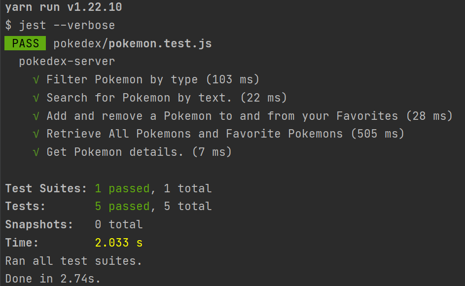
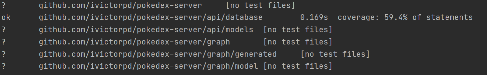

# Pokedex-Server - GraphQL

Pokedex Server Graphql Repository. I have used a dynamodb database together with a graphql library to go
(github.com/99designs/gqlgen)


## 1. Stack

- [go1.15.8](https://golang.org/dl/)
- [Node](https://serverless.com/)


---

## 2. Requirements

- Go version 1.15.8 or higher.
- npm version 6.4.1 or higher.
- yarn version 1.22.10 or higher.
- docker version 15.10.2 or higher.
---

## 3. Project setup

Download this repository, open a terminal, and move into it.

### 3.1. Requirements installation steps

```bash
# install dependencies
go mod tidy
cd test-functional
yarn
```

---

## 4. Change GraphQL schema

```bash
# When we change graphql schema, we have to execute this command to autorefresh go files into graph directory
gqlgen generate
```

---
## 5. Execute test

### 5.1. Unit test

```bash
go test ./...
```
### 5.1. Unit test coverage

```bash
go test ./... -cover
```

### 5.2. Functional test

```bash
# 
cd test-functional
yarn test
```
> NOTE: To execute functional test we need execute docker containers

## 6. Docker

> NOTE: we have two docker images, one of them is the dynamodb (Database) and the other is the graphql server which contains all the logic
```bash
# to execute docker containers
docker-compose up -d
```

## 7. GraphQL schema
```bash
    type Query {
        #limit is to set the number of the number of records that you want to return
        
        #Get a list of pokemons, we can filter by favorite pokemon (isfavorite)
        #we can filter by Name pokemon if we pass the SearchName variable
        #we can filter by Type pokemon if we pass the SearchType variable
        listPokemon(input: PokemonsQueryInput!): PokemonConnection!
        #We obtain details of one pokemon when we pass a id variable
        getPokemonById(id: ID!): Pokemon
        #we get a list of diferent names of type of all pokemons
        listPokemonTypes: [String!]!
    }

    type Mutation {
        #we update favorite to pokemon sending true or false in isfavorite variable and id of pokemon
        updateFavoritePokemon(id: ID!, isFavorite: Boolean): Pokemon
    }

```
## 8. Environment Variables
```bash
    #Image Url of jpg of pokemon 
    IMAGE_URL: "https://img.pokemondb.net/artwork/"
    #Base Url to get the sounds of repo
    BASE_URL: "https://git.com/"
    #Name of table of database
    TABLE_NAME : "Pokemon"
    #Entry point of dynamodb server
    ENTRY_POINT: "http://172.25.0.101:8000"
```


## 9. Example functional test


## 9.1 Example unit test coverage
